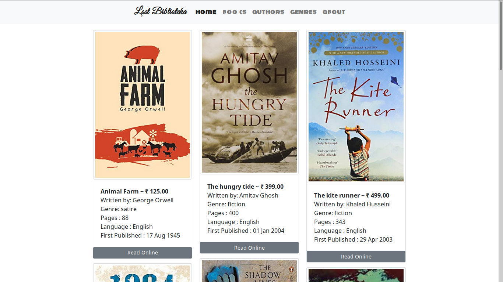
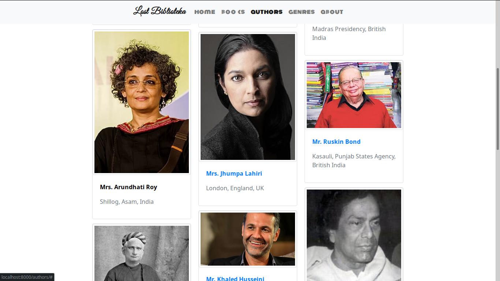
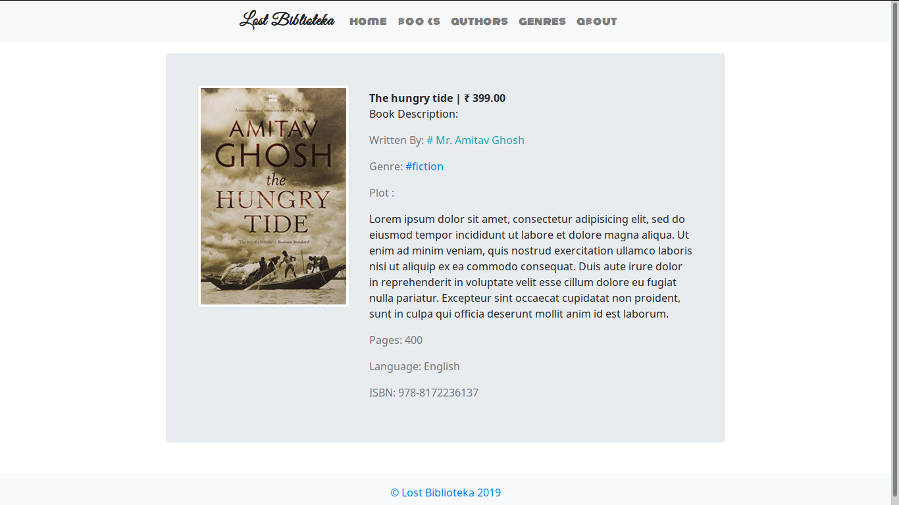
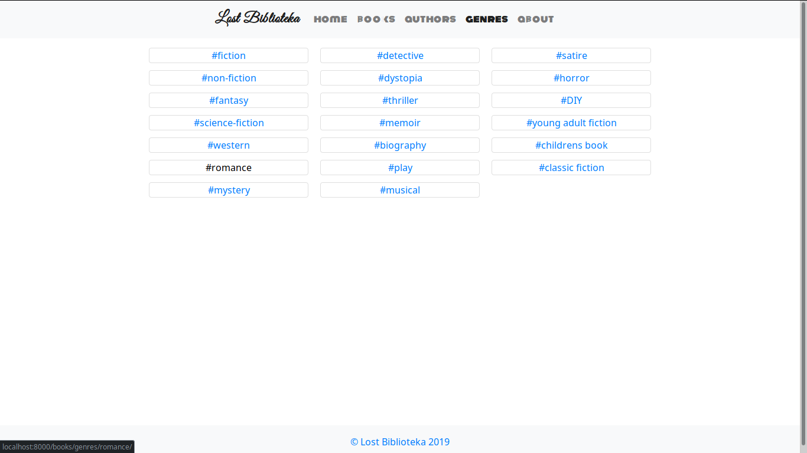
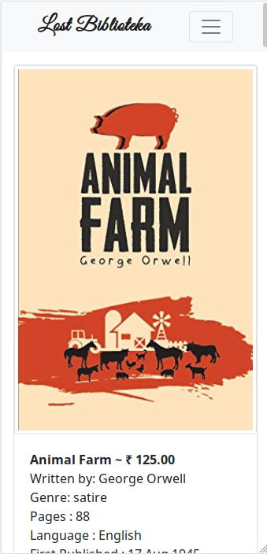

# _Lost Biblioteka_

 A simple website where you can read a few books chosen by us. This website has been developed with [django2.2](https://djangoproject.com) and [Bootstrap4.3](https://getbootstrap.com). Though the `Reading feature` of this site is not completed yet. And most of the pages have dummy data for now. But it is connected to a real database of [MariaDb](https://mariadb.org). This is a django version of the original project in Angular and .NET by [Amit](https://github.com/amit5211/Bibliotheca.git). 
 
 # Home Page
 
 
 
 ##### _Description_: `At present is as same as the book tab. Later on it'll be populated with new events and new uploaded books and many cool features. Still you can go to Read Online and see a little details about the book. Which is genrousely scraped from <amazon.in>. At book tab users can search any book by name and get a list of books.`
 
 # Authors Page
 
 
 
 ##### _Description_: `All the authors with 12 data per page can be seen in this page. You can see their profile and there you will find all the books written by the author and maybe in future also read a lot of them. There is a search bar at the top below the navigation bar, users can search with the partial of the name of any author and get a list of authors.`
 
 # Read A Book Page
 
 
 
  ##### _Description_: `This tab will be the most interesting page of our website. Here you can read book(not implemented yet) and uses will also be able to customize this page look when they read a book. Customization will allow them to change font, font-size, background-color and line-gap in paragraphs.`
  
 # Genre Page
 
 
 
  ##### _Description_: `This page has all the famous catagories of books and users can click on them to look which books fall into that genre. Every single link leads to a list books.`
  
 # Some Mobile View Experiece
  
  ##### _Description_: `After all it uses bootstrap the latest version 4.3. So the mobile experience is awesome and the menu will be collasped in a humburger toggle button at the right top corner.`
  
  
# Steps to Local Development:
> ### Requirements:
> * [Python3.7](https://python.org) or higher with pip or anaconda installed.
> * [MariaDB](https://mariadb.org) or any sql database or even postgres installed.
>   


```bash
$ git clone https://eatDatCode/lostBiblioteka.git

$ pip install -r requirements.txt

$ mysql biblioteka < biblioteka.sql 

$ ./manage.py runserver 0:8000
```

Tips: First make sure you have created a database name `biblioteka` in your local system. And then add the needful in the file of `src/biblioteka/settings.py` in the project. Read the documentation in [https://docs.djangoproject.com/en/2.2.](https://docs.djangoproject.com/en/2.2/ref/databases/#mysql-notes) <hr>
